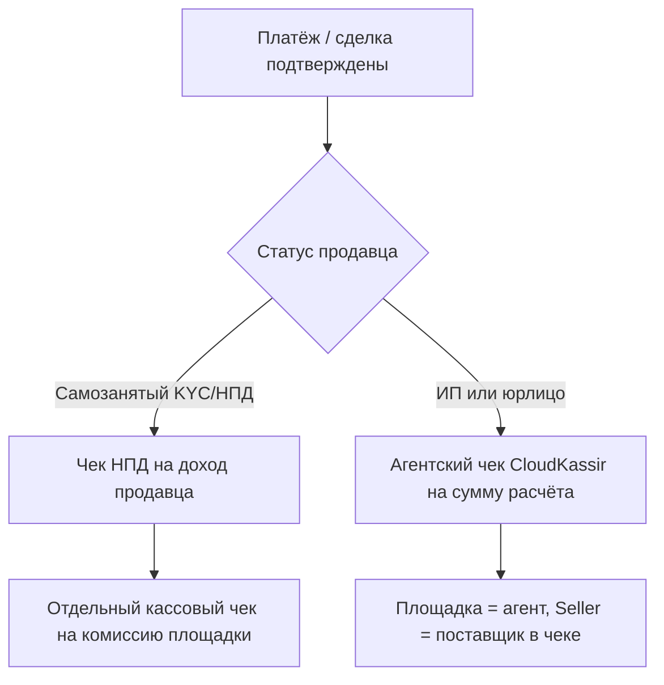
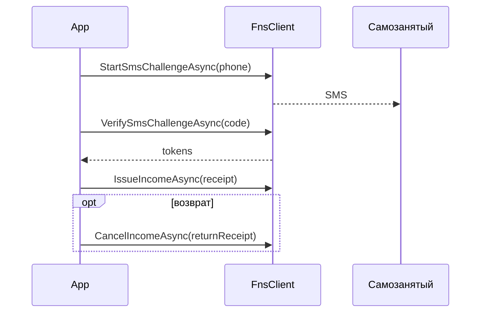

# Процесс: фискализация (НПД + CloudKassir)

Цель: после оплаты / безопасной сделки выпустить правильный фискальный документ.

В продуктах OpenMoney это **два разных контура**:

| Контур | Когда | Пакеты |
|---|---|---|
| **«Мой налог» (НПД)** | Бенефициар — **самозанятый**, доход регистрируется в ФНС | `OpenMoney.Fiscal` (`FnsClient`) |
| **CloudKassir (облачная касса)** | Чек **прихода** площадки (комиссия) или **агентский** чек за ИП/юрлицо | `OpenMoney.CloudPayments`, модели в `OpenMoney.Fiscal`, paycheck в `OpenMoney.TBank` |

Без кассы «безопасная сделка» незавершена: банк уже мог выплатить деньги, а фискальный след ещё нет.

Связка со сделками: [safe-deal](safe-deal.md).

---

## Какой чек когда (как в ФинСети)



| Продавец | Документ на доход продавца | Документ на комиссию площадки |
|---|---|---|
| Самозанятый | Чек НПД (`IssueIncomeAsync`, тип плательщика `FROM_INDIVIDUAL` / `FROM_LEGAL_ENTITY`) | Обычный чек прихода CloudKassir на сумму комиссии |
| ИП / ООО | **Агентский** чек CloudKassir (`AgentSign = 6`, `purveyorData` продавца) | Часто уже «внутри» агентской схемы / отдельный учёт |

Ставка НПД: доход от физлица — **4%**, от юрлица/ИП — **6%** (режим НПД; в API мы передаём `incomeType`, ставку считает ФНС).

---

## 1. CloudKassir — чеки прихода и агентские

### Через OpenMoney.CloudPayments

Пакет: [cloudpayments.md](../packages/cloudpayments.md).  
Endpoint: `POST /kkt/receipt`.

```csharp
services.AddOpenMoneyCloudPayments(o =>
{
    o.PublicId = configuration["CloudPayments:PublicId"]!;
    o.ApiSecret = configuration["CloudPayments:ApiSecret"]!;
    o.Inn = configuration["CloudPayments:Inn"]!;           // ИНН владельца кассы (площадки)
    o.CalculationPlace = "merchant.example";
});
```

#### Чек прихода на комиссию площадки

Упрощённый helper:

```csharp
await cloud.IssueCommissionReceiptAsync(
    invoiceId: orderId,
    accountId: userId,
    amountMinorUnits: commissionKopecks,
    label: "Комиссия площадки",
    type: ReceiptType.Income,
    ct);
```

Или полный `IssueReceiptAsync(ReceiptRequest)` с позициями, СНО, `InvoiceId` / `AccountId`.

Типы чека в модели: приход / возврат прихода (и связанные) — см. `ReceiptType` в SDK.

#### Агентский чек (ИП / юрлицо как поставщик)

В позиции чека указываются:

- `AgentSign = 6` — «агент» (площадка оказывает услугу как агент, не БПА);
- `PurveyorData` / поставщик — ИНН, имя, телефон **продавца**.

В `OpenMoney.Fiscal` это собирает фабрика:

```csharp
var payload = CloudKassirReceiptFactory.CreatePayload(new FiscalReceipt(
    Type: FiscalReceiptType.Income,
    TaxationSystem: FiscalTaxationSystem.SimplifiedIncome,
    Inn: platformInn,
    InvoiceId: orderId,
    AccountId: accountId,
    CalculationPlace: "merchant.example",
    Items:
    [
        new FiscalReceiptItem(
            Label: "Оплата услуги",
            Price: 1000.00m,
            Quantity: 1,
            Vat: sellerVat,
            Supplier: new FiscalSupplier(sellerPhone, sellerName, sellerInn))
        // Supplier != null → agentSign = 6 + purveyorData
    ]));

// дальше отправьте payload в CloudKassir (CloudPaymentsClient.IssueReceiptAsync
// или свой HTTP к /kkt/receipt)
```

`FiscalReceiptType`: `Income`, `IncomeReturn`, `Expense`, `ExpenseReturn`.  
Возврат — тем же контуром с типом возврата прихода.

### Через OpenMoney.TBank (paycheck → тот же CloudKassir)

В ФинСети чеки часто уходили через обёртку Т‑Банка (`/kkt/receipt` с credentials CloudPayments на стороне сервиса):

| Метод | Назначение |
|---|---|
| `MakePaycheckAsync` | Чек **прихода** (обычно на **комиссию** площадки) |
| `MakeReturnPaycheckAsync` | Возврат такого чека |
| `MakeAgentPaycheckAsync` | **Агентский** чек на полную сумму (ИП/юрлицо) |
| `MakeReturnAgentPaycheckAsync` | Возврат агентского |

```csharp
// комиссия площадки, продавец-самозанятый
await tbank.MakePaycheckAsync(new RequestPaycheckContext
{
    Amount = commissionMinorUnits,
    CustomerKey = sellerUserId,
    OrderId = orderId
}, ct);

// ИП / юрлицо — агентский чек на сумму заказа
await tbank.MakeAgentPaycheckAsync(new RequestAgentPaycheckContext
{
    Amount = orderMinorUnits,
    CustomerKey = sellerUserId,
    OrderId = orderId,
    Label = "Оплата заказа",
    CustomerInn = sellerInn,
    CustomerName = "ИП …" / название ООО,
    CustomerPhone = sellerPhone,
    TaxationSystem = sellerSno,
    Vat = sellerVat
}, ct);
```

Нужны `CloudPaymentsLogin` / `CloudPaymentsPassword` / `Inn` в `TBank` options (см. [configuration](../configuration.md)).

---

## 2. «Мой налог» — чек НПД самозанятого

Пакет: **OpenMoney.Fiscal** (`FnsClient`).  
Только проверка статуса ИНН без дохода — также `OpenMoney.Kyc` (`MoyNalogKycClient`); **регистрация дохода** — Fiscal.



### Проверка статуса (без SMS)

```csharp
var status = await fns.CheckTaxpayerStatusAsync("############", ct: ct);
```

Пример: `NPD_INN=…` и `dotnet run --project examples/OpenMoney.SdkExamples -- fiscal`.

### SMS‑auth

1. `StartSmsChallengeAsync(phone, userAgent)`
2. `VerifySmsChallengeAsync(phone, code, challengeToken, new FnsDevice(deviceId, userAgent))`
3. Хранить `FnsTokens`; `RefreshTokenAsync` при необходимости
4. Authenticated‑методы делают один retry после refresh

### Доход и отмена

```csharp
await fns.IssueIncomeAsync(
    new FnsIncomeReceipt(
        AmountMinorUnits: payoutKopecks,
        Description: "Оплата услуги",
        Customer: new FnsReceiptCustomer(FnsCustomerKind.Individual), // FROM_INDIVIDUAL
        PaymentType: FnsPaymentType.Cash),
    tokens, device, ct);

await fns.CancelIncomeAsync(
    new FnsReturnReceipt(originalUuid, taxPeriodId, amount, description),
    tokens, device, ct);
```

Печать чека НПД — URL вида `lknpd.nalog.ru/.../print` (uuid из ответа).

---

## Практика площадки

1. Сначала зафиксируйте **кто бенефициар** (статус из KYC/онбординга).
2. После успешного pay-in / confirm сделки:
   - самозанятый → НПД на его сумму + CloudKassir на комиссию;
   - ИП/юрлицо → агентский CloudKassir (через CloudPayments или TBank paycheck).
3. Возвраты денег покупателю сопровождайте **возвратными** чеками (`MakeReturn*`, `IncomeReturn`, `CancelIncomeAsync`).
4. Не логируйте полные тела чеков с ИНН/телефонами в публичные логи.
5. ИНН кассы площадки и ключи CloudKassir — только secret store.

---

## Связанные документы

- [Безопасная сделка](safe-deal.md) — когда какой чек в контексте TBank / Tochka / YooMoney
- [Выплаты](payout.md)
- [Реестр НПД](npd-registry.md) — массовые чеки org→самозанятые (другой контур)
- [KYC](kyc-session.md)
- Пакеты: [fiscal.md](../packages/fiscal.md), [cloudpayments.md](../packages/cloudpayments.md), [tbank.md](../packages/tbank.md)
