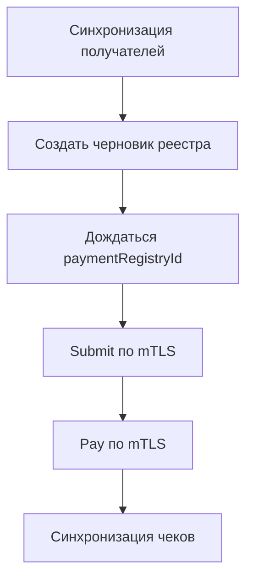

# Процесс: реестр выплат самозанятым (НПД)

Пакет: **OpenMoney.SelfEmployed** (`NpdClient`, секция `TBankNpd`).

Цель: организация выплачивает самозанятым через реестр Т‑Банк Бизнес, затем забирает чеки.



## Подготовка

1. Зарегистрируйте `INpdRecipientStore` и `INpdReceiptStore`.
2. `AddOpenMoneySelfEmployed(configuration.GetSection("TBankNpd"))`.
3. Для submit/pay/receipts — клиентский сертификат mTLS в options.
4. Песочница: `UseSandbox = true`.

## Получатели

```csharp
// Одна страница
await npd.ListRecipientsAsync(new RecipientsListRequest { Offset = 0, Limit = 50 }, ct);

// Все страницы → store
await npd.CheckNpdAsync(ct);

// Добавление по реквизитам (async)
var corr = await npd.AddRecipientsByRequisitesAsync(request, ct);
var result = await npd.GetAddResultAsync(corr.CorrelationId, ct);
```

## Реестр выплат

1. `CreatePaymentRegistryAsync` — черновик с платежами.
2. `GetPaymentRegistryCreateResultAsync` — получить `paymentRegistryId`.
3. `SubmitPaymentRegistryAsync` (mTLS) → `GetSubmitResultAsync`.
4. `PayPaymentRegistryAsync` (mTLS) → `GetPayResultAsync`.
5. При необходимости `ListPaymentRegistryIdsAsync`.

## Чеки

```csharp
await npd.RequestRegistryReceiptsAsync(...);
await npd.GetRegistryReceiptsResultAsync(...);
// или пакетно:
await npd.SyncRegistryReceiptsAsync(...);
```

Опционально: `NpdReceiptSyncHostedService` / `NpdStatusChecker` при регистрации DI с флагами background.

## Пример

`dotnet run --project examples/OpenMoney.SdkExamples -- npd`  
Документ пакета: [selfemployed.md](../packages/selfemployed.md).

## Чеклист

- [ ] Получатели актуальны (статус НПД)
- [ ] mTLS сертификат валиден на среде
- [ ] Идемпотентность create/submit на стороне хоста
- [ ] Чеки сохранены без утечки PII в логи
