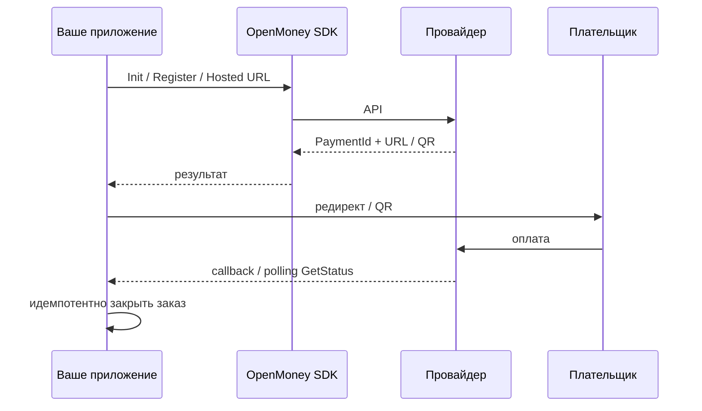

# Процесс: приём оплаты (pay-in)

Цель: принять деньги от плательщика и зафиксировать успешный статус в своей системе.

## Выбор провайдера

| Сценарий | Пакет | Точка входа |
|---|---|---|
| Классический эквайринг Т‑Банка | TBank | `InitPayInAsync` → `PaymentURL` |
| Hosted‑форма / СБП Inwizo | Inwizo | `InitializeHostedPayment` |
| ВТБ карта или СБП QR | VTB | `StartPaymentAsync(byCard)` |
| Криптограмма с виджета | CloudPayments | `ChargeCryptogramAsync` / `AuthorizeCryptogramAsync` |
| Marketplace «Точка» | Tochka | recipient → card → `CreateOrderAsync` |

## Т‑Банк (типовой)

1. Создайте локальный заказ со статусом `pending`, своим `OrderId`.
2. `InitPayInAsync` — сумма в копейках, Success/Fail/Notification URL.
3. Отправьте пользователя на `PaymentURL`.
4. Параллельно: webhook + `GetStatusAsync(PaymentId)`.
5. При успехе — fulfillment **один раз** (идемпотентный ключ = PaymentId/OrderId).
6. Отмена/возврат: `CancelAsync`.

Двухстадийность (если включена на терминале): Init → Charge/Confirm по сценарию кабинета.

См. [пакет TBank](../packages/tbank.md), пример `-- tbank`.

## ВТБ RBS

1. `StartPaymentAsync(orderNumber, amount, byCard: true|false)`.
2. При карте — URL формы; при СБП — payload QR.
3. Сохраните `merchantOrderId` и `bankOrderId`.
4. Callback: `VtbCallbackParser.Parse` → `IVtbCallbackVerifier.Verify` → обновить статус.

См. [пакет VTB](../packages/vtb.md).

## Inwizo hosted

1. `InitializeHostedPayment(orderId, amountMinor, email, Card|Sbp)`.
2. Редирект на `PaymentUrl`.
3. `GetPaymentStatusAsync(transactionId, externalPaymentId, method)`.

## CloudPayments

1. На клиенте получите `CardCryptogramPacket` (виджет) — **не** принимайте PAN/CVV.
2. Одностадийно: `ChargeCryptogramAsync`.
3. Двухстадийно: `AuthorizeCryptogramAsync` → после доставки `ConfirmAsync`; отмена холда `VoidAsync`; возврат `RefundAsync`.

## Tochka (Medusa)

1. `CreateRecipientAsync` → `CreateCardAsync` (форма привязки карты).
2. `CreateOrderAsync` с amount/commission/service/card.
3. Плательщик проходит acquiring redirect.
4. `ConfirmAllServicesAsync` / `SetOrderDecisionAsync` после оказания услуги.

## Чеклист перед боем

- [ ] Суммы в правильных единицах
- [ ] OrderId уникален и сохранён до Init
- [ ] Notification URL доступен извне, идемпотентен
- [ ] Секреты не в git / логах
- [ ] Прогнан UAT сценарий success + fail + повторный callback
