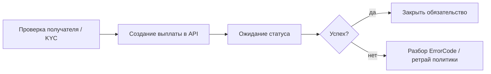

# Процесс: выплаты (payout)

Цель: перевести средства получателю (карта / токен / кошелёк) с контролем статуса.

> Выплаты — высокорисковая операция. В продукте и в MCP обязателен human‑in‑the‑loop.



## Варианты

| Сценарий | Пакет | Методы |
|---|---|---|
| E2C на карту / CardId | TBank | `InitPayoutAsync` → `PaymentAsync` |
| Moment payout (подпись) | TBank | `InitMomentPayoutAsync` → `MomentPaymentAsync` |
| Выплата на card token | Inwizo | `InitializePayoutAsync` → `GetPayoutStatusAsync` |
| Выплата в рамках safe_deal | YooMoney | `CreatePayoutAsync` после баланса сделки |

## Т‑Банк E2C

1. Настройте `PayoutTerminalKey` / `PayoutTerminalPassword`.
2. При необходимости зарегистрируйте клиента и карту payout‑API (`AddPayoutCustomerAsync`, `AddPayoutCardAsync`).
3. `InitPayoutAsync` (сумма в копейках, `OrderId`, `CardId` / deal).
4. Подтверждение выплаты `PaymentAsync` по сценарию терминала.
5. Мониторьте статус; храните связку OrderId ↔ PaymentId.

Для signed moment payout нужны PEM в options.

## Inwizo

```csharp
var init = await client.InitializePayoutAsync(
    new InwizoPayoutRequest(orderId, amountMinorUnits, cardToken, externalPaymentId), ct);
var status = await client.GetPayoutStatusAsync(init.TransactionId, init.ExternalPaymentId, ct);
```

## ЮKassa (только после safe_deal)

См. [безопасная сделка](safe-deal.md). Кратко:

1. Сделка открыта, платёж оплачен, `HasDealBalanceAsync == true`.
2. Есть `payout_token` получателя.
3. `CreatePayoutAsync` на сумму settlement.
4. Не вызывайте payout «впрок» до баланса.

## Самозанятые (массовые выплаты)

Для реестров org → НПД используйте [SelfEmployed](npd-registry.md), а не одиночный E2C‑payout.

## Чеклист

- [ ] Получатель идентифицирован / карта принадлежит ему
- [ ] Сумма и комиссия согласованы с бухгалтерией
- [ ] Идемпотентный OrderId
- [ ] Аудит: кто инициировал выплату
- [ ] Sandbox пройден до боя
