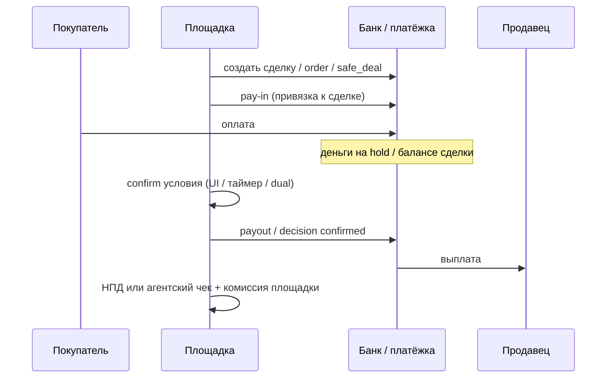
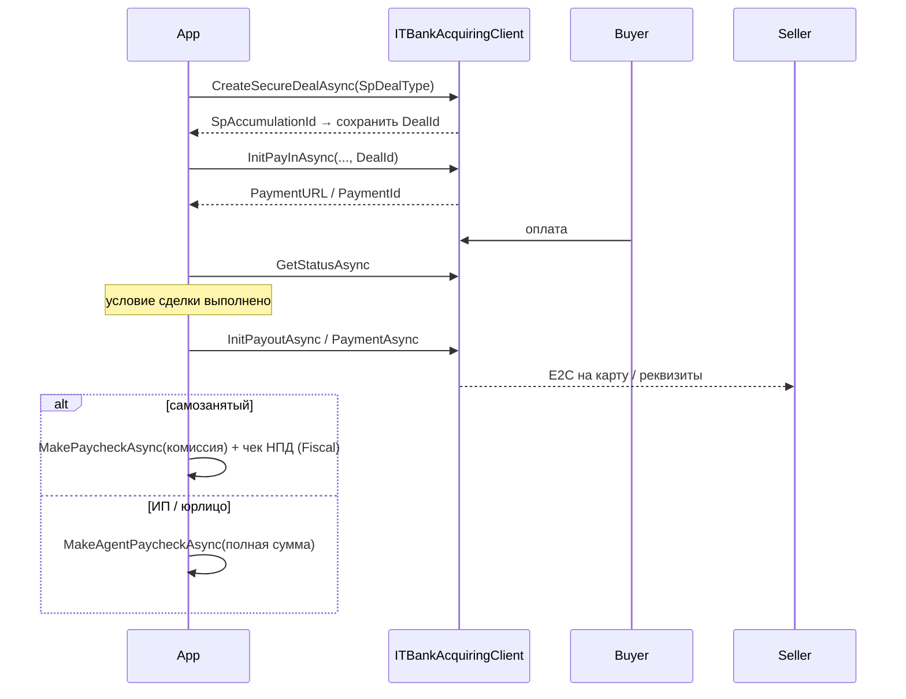
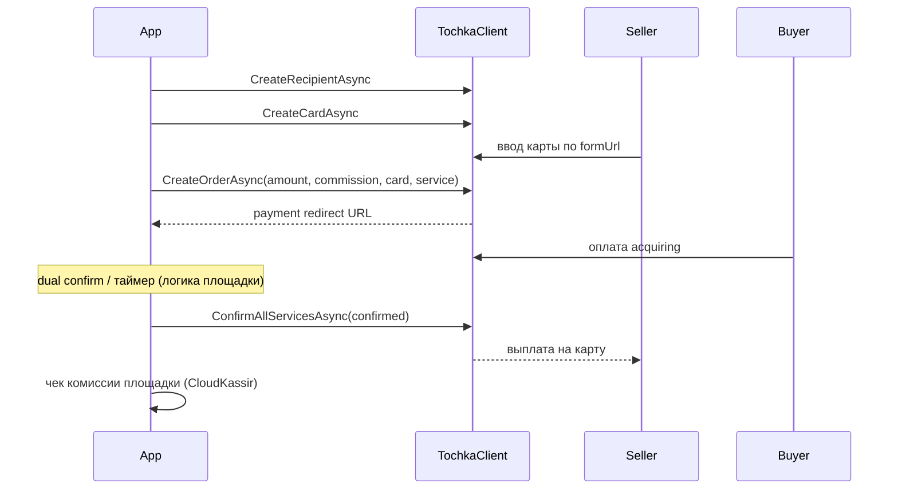
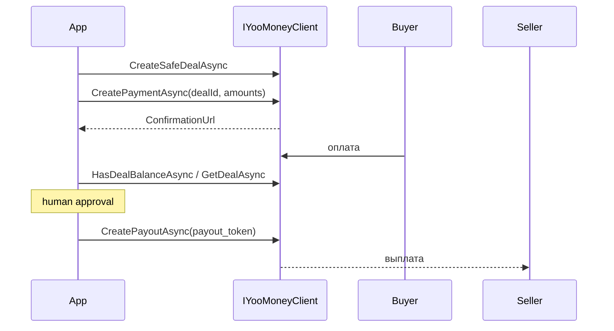

# Процесс: безопасная сделка

Цель: принять оплату от покупателя, **удержать** средства до условия сделки, выплатить продавцу (одному или нескольким) и закрыть фискальную часть.

В OpenMoney это не «только ЮKassa». Три основных банковских/платёжных контура:

| Контур | Пакет | Где жил в продуктах |
|---|---|---|
| Т‑Банк secure deal → **Мультирасчёты** | `OpenMoney.TBank` | **ФинСеть** (основной) |
| Точка **Medusa** | `OpenMoney.Tochka` | **Сделка и Точка** |
| ЮKassa `safe_deal` | `OpenMoney.YooMoney` | **Qasa** (один из вариантов) |

Inwizo в Qasa решал ту же продуктовую задачу (pay‑in → later payout), но без отдельной сущности «сделка банка» — см. кратко в конце и [payout](payout.md).

Общая продуктовая картина и 1:1 / 1:N / N:N — в корневом [`README.md`](../../README.md).

---

## Общая схема (любой провайдер)

Деньги и чеки — **разные** контуры: банк двигает средства, Fiscal/CloudKassir оформляют документы. См. [fiscal-income](fiscal-income.md).

---

## Т‑Банк (ФинСеть / Мультирасчёты)

Это **главный** боевой контур OpenMoney для marketplace‑сделок.

Продукт Т‑Бизнес сейчас называется [«Мультирасчёты»](https://www.tbank.ru/business/online-payments/multi-calculation-service/) (раньше в интеграциях чаще говорили «безопасная сделка»). Смысл: принять оплату, заморозить, после подтверждения выплатить физлицу и/или юрлицу, площадка забирает вознаграждение; поддерживается сплит на нескольких исполнителей.

### SDK

Пакет: [tbank.md](../packages/tbank.md).

| Шаг | Метод |
|---|---|
| Создать сделку | `CreateSecureDealAsync` → `POST /v2/createSpDeal` |
| Тип сделки | `RequestCreateSecureDealContext.SpDealType` |
| Pay-in в сделку | `InitPayInAsync` с `DealId` |
| Статус | `GetStatusAsync` |
| Выплата | `InitPayoutAsync` / `PaymentAsync` (E2C; часто с тем же `DealId`) |
| Чек комиссии | `MakePaycheckAsync` |
| Агентский чек | `MakeAgentPaycheckAsync` |

Ответ создания сделки содержит `SpAccumulationId` (сохраняйте как `DealId` продавца/площадки).

### Типы `SpDealType`

| Значение | Константа в SDK | Типичный смысл |
|---|---|---|
| `NN` | `SecureTransactionType.DealNN` (default) | Накопительная / многосторонняя модель площадки |
| `1N` | `SecureTransactionType.Deal1N` | Один входящий поток → несколько участников (реселл/реферал и т.п.) |

В старых продуктовых контурах встречался также тип `N1`; в текущем `OpenMoney.TBank` в константах оставлены `NN` и `1N`. Продуктово **1:1** — частный случай (один покупатель, один продавец), часто на том же `DealId`.

### Типовой поток (как в ФинСети)

1. При онбординге/первой оплате продавца: `CreateSecureDealAsync`, сохранить `SpAccumulationId`.
2. Каждый pay-in покупателя: `InitPayInAsync` с этим `DealId` (сумма в копейках, свой `OrderId`).
3. Дождаться успеха (webhook + `GetStatusAsync`).
4. По условию сделки — E2C payout (`InitPayoutAsync` …). Нужны payout‑credentials терминала.
5. Фискализация:
   - **самозанятый** — чек НПД на доход продавца ([fiscal-income](fiscal-income.md), тип `FROM_INDIVIDUAL` для платежа от физлица) + часто отдельный кассовый чек **на комиссию** площадки;
   - **ИП/юрлицо** — **агентский** чек CloudKassir на сумму расчёта (`MakeAgentPaycheckAsync`, признак агента).

### N:N на Т‑Банке

Один `DealId` может жить долго: много pay-in от разных покупателей → одна или несколько выплат продавцу. Это и есть операционная модель ФинСети. Идемпотентность OrderId/PaymentId и повторных callback обязательна — см. [amounts-and-ids](../concepts/amounts-and-ids.md).

### Важно

- Нужен договор/терминал под безопасные сделки / Мультирасчёты — обычного эквайринга недостаточно.
- Перед боем — UAT и актуальная документация Т‑Банка (API номинальных счетов / сделок развивается отдельно от старого `createSpDeal`).
- Не логируйте Token, TerminalPassword, данные карт.

Пример базового pay-in (без DealId): `dotnet run --project examples/OpenMoney.SdkExamples -- tbank`  
Полный secure‑deal сценарий собирайте в приложении: create deal → init с `DealId` → payout → paycheck.

---

## Точка / Medusa (Сделка и Точка)

Официальный бизнес‑процесс: [Medusa — бизнес-процесс](https://developers.tochka.com/docs/medusa/how-it-works/business-process).  
Пакет: [tochka.md](../packages/tochka.md).

Здесь «сделка» = **order** с услугами (`Services`), эквайринговым входящим платежом и получателем на карту.

### SDK

| Шаг | Метод |
|---|---|
| Исполнитель | `CreateRecipientAsync` |
| Карта выплаты | `CreateCardAsync` → `formUrl` |
| Сделка | `CreateOrderAsync(TochkaCreateOrderRequest)` |
| Статус | `GetOrderAsync` |
| Confirm / reject | `SetOrderDecisionAsync` / `ConfirmAllServicesAsync` |
| Sandbox-симуляции | `RunSandboxOperationAsync` (**только** при `EnableSandboxOperations`) |

### Типовой поток

1. Создать recipient (продавца).
2. Привязать карту (`CreateCardAsync`).
3. `CreateOrderAsync`: `OrderId`, `RecipientId`, `CardId`, `ServiceId`, суммы в копейках, `commission`, email чека, purpose, redirect URL.
4. Покупатель оплачивает acquiring‑URL из ответа.
5. Площадка принимает решение по услугам: `confirmed` → выплата исполнителю; `rejected` → возврат покупателю.
6. Комиссия площадки / эквайринга закладывается в структуру order; фискальный чек комиссии часто делали отдельно через CloudPayments.

В одном order может быть **несколько услуг и продавцов** — это 1:N / N:N на стороне Точки.

### Важно

- Все запросы подписываются RSA (PEM в конфиге) — см. [configuration](../configuration.md).
- В проде `EnableSandboxOperations = false`. Sandbox-методы (`proceed_service_payout_*` и т.п.) не путать с боевой выплатой после `decisions`.
- Официально Точка требует фискализацию оплат; детали — в их разделе «Фискализация чеков».

Пример recipient: `dotnet run --project examples/OpenMoney.SdkExamples -- tochka`

---

## ЮKassa `safe_deal` (Qasa)

Пакет: [yoomoney.md](../packages/yoomoney.md).  
Документация ЮKassa: [сделки](https://yookassa.ru/developers/solutions-for-platforms/safe-deal/integration/deals), [быстрый старт](https://yookassa.ru/developers/solutions-for-platforms/safe-deal/quick-start/freelance), [выплаты](https://yookassa.ru/developers/solutions-for-platforms/safe-deal/integration/payouts).

### Шаги

1. `CreateSafeDealAsync(new YooCreateDealRequest(description))`.
2. `CreatePaymentAsync`:
   - `AmountMinorUnits` — сколько платит покупатель;
   - `PayoutAmountMinorUnits` — сколько уйдёт на выплату продавцу;
   - `DealId`, `ReturnUrl`.
3. Покупатель открывает `ConfirmationUrl`.
4. `HasDealBalanceAsync` / `GetDealAsync`.
5. `CreatePayoutAsync` с `PayoutToken` и своим `OrderId`.

В Qasa для ЮKassa часто создавали **новую сделку на каждый платёж** (короткий цикл 1:1). Разница amount − payoutAmount — вознаграждение площадки (и запас под комиссию ЮKassa).

Пример: `dotnet run --project examples/OpenMoney.SdkExamples -- yoomoney`

### Правила

- `payout_token` не в git — только в момент выплаты.
- Повторный payout без баланса сделки завершится ошибкой.
- Срок жизни `safe_deal` ограничен настройками магазина в ЮKassa.

---

## Inwizo (тот же продукт, другой транспорт)

В Qasa без ЮKassa/Т‑Банка сценарий был: `InitializeHostedPayment` → статус → `InitializePayoutAsync`. Отдельного `createSpDeal`/Medusa order нет — hold и правила выплат на стороне провайдера и очереди приложения. Пакет: [inwizo.md](../packages/inwizo.md). `BaseUrl` — **именной** host из env (`Inwizo__BaseUrl`), без хардкода в SDK.

---

## Фискализация после сделки

| Бенефициар | Что делать |
|---|---|
| Самозанятый | Чек НПД на доход ([fiscal-income](fiscal-income.md)); чек комиссии площадки отдельно |
| ИП / юрлицо | Агентский чек CloudKassir (`MakeAgentPaycheckAsync` / Fiscal helpers) |

KYC до допуска к выплатам: [kyc-session](kyc-session.md).

---

## Что выбрать

| Если… | Берите |
|---|---|
| Маркетплейс на Т‑Банке, накопление DealId, E2C, НПД/агент | **TBank** |
| Площадка на Точке, order + dual confirm + карта recipient | **Tochka Medusa** |
| Короткий цикл сделка→оплата→payout в ЮKassa | **YooMoney** |
| Hosted pay-in/payout без банковской «сделки» | **Inwizo** |

---

## Связанные документы

- [Приём оплаты](pay-in.md)
- [Выплаты](payout.md)
- [Фискализация](fiscal-income.md)
- [Реестр НПД](npd-registry.md) — массовые выплаты org→самозанятые (другой контур, не marketplace deal)
- Корневой [README](../../README.md) — продуктовый разбор 1:1 / 1:N / N:N
